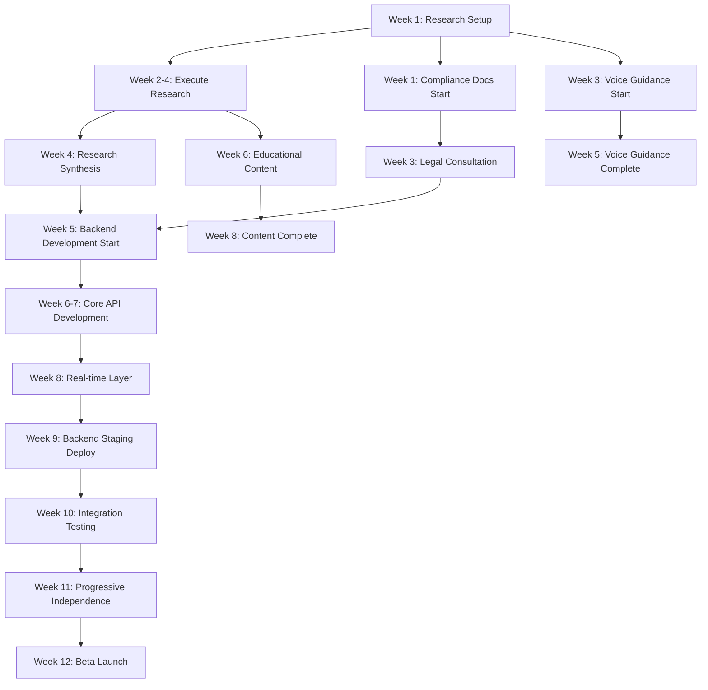

# 📅 KidMap: 90-Day Visual Roadmap

**Timeline:** Weeks 1-12 (October - December 2025)  
**Goal:** Beta launch with 100+ families

---

## 🗓️ Timeline Overview

Week 1-4: RESEARCH & VALIDATION SPRINT
Week 5-8: TECHNICAL FOUNDATIONS
Week 9-12: INTEGRATION & BETA LAUNCH

---

## 📊 Gantt-Style View

┌──────────────────────────────────────────────────────────────────┐
│ WEEK 1-4: RESEARCH & VALIDATION │
├──────────────────────────────────────────────────────────────────┤
│ │
│ ████████████ User Research Sprint │
│ └─ Parent Interviews (15-20) │
│ └─ Child Usability Sessions (20+) │
│ └─ Educator Consultations (5-7) │
│ └─ Special Needs Specialists (3-5) │
│ │
│ ████████ Compliance Documentation │
│ └─ COPPA Checklist │
│ └─ GDPR/CCPA Matrices │
│ └─ Privacy Lawyer Consultation │
│ │
│ ████ Strategic Documentation │
│ └─ UVP Document │
│ └─ Competitive Positioning │
│ └─ User Personas & Journey Maps │
│ │
│ ████ Voice Guidance Prototype │
│ └─ Expo Speech API Research │
│ └─ Initial Implementation │
│ │
│ ███ Offline Validation │
│ └─ Test Scenario Creation │
│ └─ Documentation │
│ │
└──────────────────────────────────────────────────────────────────┘

┌──────────────────────────────────────────────────────────────────┐
│ WEEK 5-8: TECHNICAL FOUNDATIONS │
├──────────────────────────────────────────────────────────────────┤
│ │
│ ████████████████ Backend Service Development │
│ └─ Fastify + PostgreSQL Setup │
│ └─ Prisma ORM Configuration │
│ └─ Authentication Endpoints │
│ └─ Safe Zone API │
│ └─ Socket.io Real-time Layer │
│ │
│ ████████ Voice Guidance Completion │
│ └─ User Testing │
│ └─ Settings Integration │
│ └─ Accessibility Menu │
│ │
│ ████████ Educational Content │
│ └─ Navigation Lessons │
│ └─ Geography Modules │
│ └─ Safety Scenarios │
│ │
│ ████ Partnership Outreach │
│ └─ School/Program Contacts │
│ └─ Pilot Design │
│ │
└──────────────────────────────────────────────────────────────────┘

┌──────────────────────────────────────────────────────────────────┐
│ WEEK 9-12: INTEGRATION & BETA LAUNCH │
├──────────────────────────────────────────────────────────────────┤
│ │
│ ████████ Backend Deployment │
│ └─ Railway Staging │
│ └─ Integration Testing │
│ └─ Production Deployment │
│ │
│ ████████████ Progressive Independence │
│ └─ Level System Implementation │
│ └─ Progression UI │
│ └─ Parent Approval Workflows │
│ └─ User Testing │
│ │
│ ████████ Beta Preparation │
│ └─ Recruit 100+ Families │
│ └─ Onboarding Materials │
│ └─ Feedback Channels │
│ │
│ ████ Beta Launch 🚀 │
│ └─ Week 12 Target │
│ │
└──────────────────────────────────────────────────────────────────┘

---

## 🎯 Milestone Dependencies

---

## 📈 Resource Allocation

### Team Distribution by Week

RESEARCH PHASE (Weeks 1-4):
├─ Product Manager: 100% Research coordination
├─ UX Designer: 100% User testing & synthesis
├─ Frontend Engineer: 50% Voice guidance, 50% offline tests
└─ Backend Engineer: 25% Architecture planning

TECHNICAL PHASE (Weeks 5-8):
├─ Product Manager: 50% Partnership outreach, 50% content
├─ UX Designer: 50% Educational content, 50% UI polish
├─ Frontend Engineer: 75% Integration, 25% voice completion
└─ Backend Engineer: 100% Backend development

LAUNCH PHASE (Weeks 9-12):
├─ Product Manager: 75% Beta recruitment, 25% launch prep
├─ UX Designer: 50% Progressive independence UI, 50% support
├─ Frontend Engineer: 100% Progressive independence & integration
└─ Backend Engineer: 75% Deployment, 25% monitoring setup

---

## 🎬 Weekly Sprint Goals

### Week 1: Foundation

- ✅ Research infrastructure created
- ✅ Compliance framework started
- ✅ Strategic docs drafted
- ✅ Team aligned on priorities

### Week 2: Execution Begins

- ✅ First parent interviews completed (5+)
- ✅ COPPA checklist drafted
- ✅ Voice guidance research done
- ✅ Offline test scenarios written

### Week 3: Momentum Building

- ✅ 10+ parent interviews complete
- ✅ Legal consultation scheduled
- ✅ Voice guidance prototype working
- ✅ Child usability sessions start

### Week 4: Research Wrap-Up

- ✅ All research sessions complete
- ✅ Insights synthesized
- ✅ Compliance docs reviewed by lawyer
- ✅ Voice guidance user tested

### Week 5: Technical Kickoff

- ✅ Backend project scaffolded
- ✅ PostgreSQL + PostGIS configured
- ✅ First API endpoints working
- ✅ Educational content design complete

### Week 6: Core Development

- ✅ Auth system implemented
- ✅ Safe zone API working
- ✅ Navigation lessons written
- ✅ Partnership proposals sent

### Week 7: Advanced Features

- ✅ Real-time layer prototyped
- ✅ Check-in endpoints complete
- ✅ Geography modules ready
- ✅ First partnership call completed

### Week 8: Integration Prep

- ✅ Backend feature complete
- ✅ Socket.io tested
- ✅ Educational content integrated
- ✅ Staging environment ready

### Week 9: Deployment

- ✅ Backend deployed to staging
- ✅ Integration testing started
- ✅ Progressive independence design approved
- ✅ Beta recruitment started

### Week 10: Testing & Polish

- ✅ All systems integrated
- ✅ Bug fixes from testing
- ✅ Progressive independence implemented
- ✅ 50+ beta families recruited

### Week 11: Launch Prep

- ✅ Production deployment
- ✅ Monitoring active
- ✅ Onboarding materials ready
- ✅ 100+ beta families confirmed

### Week 12: Beta Launch 🚀

- ✅ Beta program live
- ✅ Support channels operational
- ✅ First user feedback collected
- ✅ Post-launch retrospective

---

## 🚦 Risk Mitigation Timeline

### High-Risk Periods

### Week 3: Legal Consultation

- **Risk:** Compliance issues identified requiring major changes
- **Mitigation:** Early lawyer engagement, buffer time built in
- **Contingency:** Extend timeline if needed, delay backend work

### Week 8: Backend Completion\*\*

- **Risk:** Technical complexity causes delays
- **Mitigation:** Experienced backend engineer, clear API spec
- **Contingency:** Reduce scope, defer non-critical endpoints

### Week 10: Integration Testing\*\*

- **Risk:** Mobile-backend integration issues
- **Mitigation:** Early integration attempts, clear contracts
- **Contingency:** Additional testing week, soft launch

### Week 11: Beta Recruitment\*\*

- **Risk:** Not enough families sign up
- **Mitigation:** Early outreach, partnership pipeline, incentives
- **Contingency:** Delay launch, expand recruitment channels

---

## 📊 Success Metrics by Phase

### Phase 1: Research (Week 4)

Target vs. Actual
─────────────────
Parent Interviews: [15-20] [** **]
Child Sessions: [20+] [** **]
Educator Consults: [5-7] [** **]
Special Needs Consults: [3-5] [** **]
Compliance Docs: [100%] [** **]
Strategic Docs: [100%] [** **]

### Phase 2: Technical (Week 8)

Target vs. Actual
─────────────────
Backend Endpoints: [100%] [** **]
Real-time Features: [100%] [** **]
Voice Guidance: [100%] [** **]
Educational Content: [100%] [** **]
Partnership Outreach: [10+] [** **]
Test Coverage: [70%+] [** **]

### Phase 3: Launch (Week 12)

Target vs. Actual
─────────────────
Beta Families: [100+] [** **]
Production Uptime: [99%+] [** **]
Crash Rate: [<0.1%] [** **]
Support Response Time: [<2hr] [** **]
User Satisfaction: [4.5+] [** **]
Compliance Approved: [✓] [** **]

---

## 🎯 Decision Gates

### Gate 1: Week 4 - Research Complete

**Decision:** Proceed with backend development?

- ✅ Research validates market need
- ✅ Compliance path is clear
- ✅ No major pivots required
- ✅ Resources secured for next phase

**If NO:** Pivot strategy, extend research, or pause development

---

### Gate 2: Week 8 - Technical Ready

**Decision:** Deploy to staging and start integration?

- ✅ Backend feature complete
- ✅ Real-time layer working
- ✅ Educational content ready
- ✅ Voice guidance implemented

**If NO:** Extend development, reduce scope, or delay launch

---

### Gate 3: Week 11 - Launch Ready

**Decision:** Launch beta program?

- ✅ 100+ families recruited
- ✅ All systems tested and stable
- ✅ Compliance approved
- ✅ Support team ready

**If NO:** Soft launch with smaller group, extend testing period

---

## 📞 Communication Cadence

### Daily (Dev Team)

- Standup: Progress, blockers, plans
- Slack updates: Async status sharing

### Weekly (Full Team)

- Sprint review: Completed work demo
- Sprint planning: Next week priorities
- Retrospective: Process improvements

### Biweekly (Stakeholders)

- Progress report: Timeline, risks, wins
- Budget review: Spend vs. plan
- Strategic alignment: Market changes

### Monthly (Leadership)

- Milestone review: Gate status
- Resource needs: Hiring, tools, partnerships
- Strategic decisions: Pivots, scope, timeline

---

## 🎊 Celebration Points

- 🎉 **Week 4:** Research complete - Team dinner
- 🎉 **Week 8:** Backend deployed - Happy hour
- 🎉 **Week 10:** 100 families recruited - Office party
- 🎉 **Week 12:** Beta launch - Public announcement + celebration

---

_This roadmap is a living document. Update weekly based on progress and learnings._
